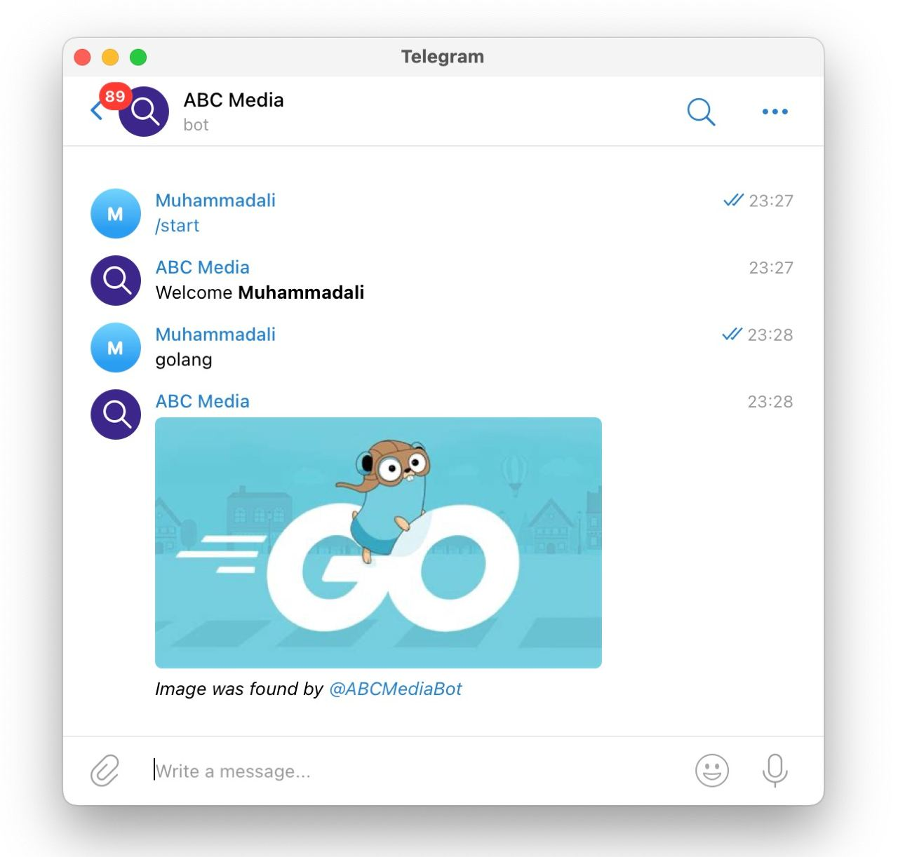

# ABC Media v1 
Sourcode and Resources for ABC Media v1  
Live project at https://telegram.me/abcmediabot

 

# Installation
* 1 - clone repo https://github.com/Muhammadali-Akbarov/search-bot
* 2 - cd into project "cd media-search-telebot"
* 3 - create an .env file add your configs
* 4 - go run main.go

# Features
* 1 - Preview and download any image!
* 2 - Preview and download any videos (coming soon)!

